# Hey, I’m John Jomi 👋

### B.Tech Computer Science student · AI/ML enthusiast · Full-stack builder

  
  
  

## About

I’m a Computer Science student specialising in AI & Machine Learning. I enjoy turning applied AI ideas into polished products—especially where thoughtful interfaces, dependable backend systems, and real user value meet.

- 🧠 Building with **AI/ML, TypeScript, Python, and cloud-native tools**
- 🎵 Shipped an AI music recommender with Spotify OAuth and Gemini
- 🌍 IEEE CIS volunteer, open-source learner, and systems-design enthusiast
- 📍 Based in India

## Selected work

  
  
  
  

## Toolkit

  

## GitHub dashboard

  

<b>More activity</b>

 

  
  

  Open to collaborating on useful AI and full-stack projects.

